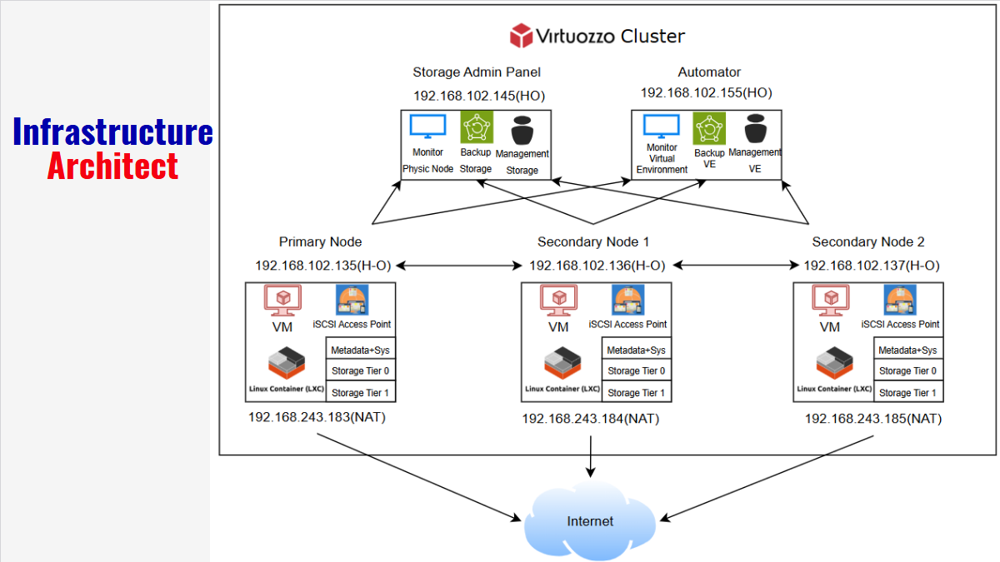

# Virtuozzo Hybrid Infrastructure - Group 4 Project

> Triển khai hạ tầng ảo hóa sử dụng Virtuozzo, bao gồm quản lý VM, Container, lưu trữ phân tán, và kiểm thử tính sẵn sàng cao.

## 📌 Mục tiêu dự án
- Tìm hiểu Virtuozzo – nền tảng hạ tầng lai (Hybrid Infrastructure)
- Xây dựng hệ thống gồm 3 node chạy Virtuozzo
- Cấu hình lưu trữ phân tán (Software-defined Storage)
- Triển khai máy ảo (VM), container, datastores, và block storage
- Backup và di chuyển VM giữa các node (Live Migration)

## 🧱 Kiến trúc hạ tầng
- **3 Virtuozzo Nodes**
- **Storage Cluster** dùng iSCSI + Erasure Coding hoặc Replication
- **VM & Container** được quản lý qua Web UI và CLI
- **Datastore** được cấu hình tiered (Tier 0–2)

## 🛠️ Công nghệ sử dụng
- **Virtuozzo Hybrid Infrastructure**
- **Virtuozzo Storage** (SDS, iSCSI, S3)
- **Live Migration**, High Availability Cluster
- **CRIU (Checkpoint/Restore In Userspace)**
- **Erasure Coding** / **Replication** cho dữ liệu

## 🔁 Demo chức năng
| Tính năng                        | Trạng thái    |
|----------------------------------|---------------|
| Tạo VM & Container               | ✅ Hoàn thành |
| Tạo Block Storage (iSCSI)        | ✅ Hoàn thành |
| Datastore và phân tầng lưu trữ   | ✅ Hoàn thành |
| Backup & Restore hệ thống        | ✅ Hoàn thành |
| Live Migration VM / Container    | ✅ Hoàn thành |

🎥 **[Xem video demo tại đây](https://drive.google.com/drive/folders/1y4NTO1aOYDokL4Ozpk_8sTm5V4eiyNHk?usp=sharing)**

## 🧪 Benchmark & Hiệu năng
- So sánh hiệu năng giữa VM và Container
- Đánh giá độ ổn định khi live migration
- Ghi nhận mức sử dụng tài nguyên với workload thực tế

## ⚠️ Hạn chế
- Yêu cầu phần cứng mạnh, mô hình phức tạp
- Chia sẻ kernel giữa containers gây bất lợi cho app đặc biệt
- Hiệu năng VM chưa bằng KVM/VMware

## 👨‍💻 Nhóm thực hiện
| Họ tên                 | MSSV      |
|------------------------|-----------|
| Nguyễn Đặng Nguyên Khang | 22520617 |
| Trần Vỹ Khang            | 22520628 |
| Hồ Hoàng Diệp            | 22520249 |

## 📁 Cấu trúc repo
